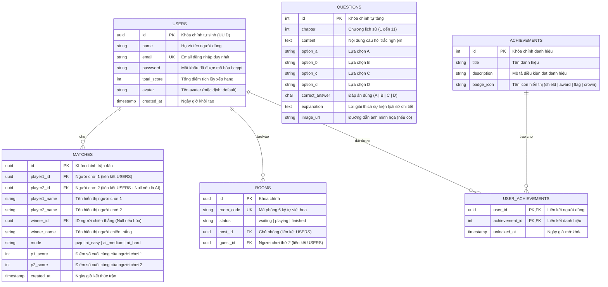
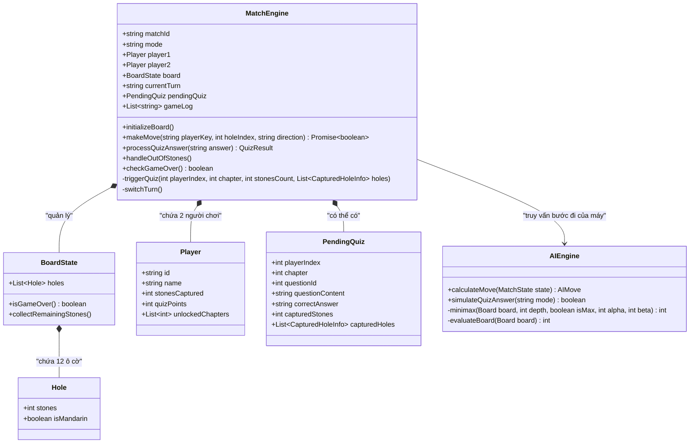

# CÁC SƠ ĐỒ THIẾT KẾ HỆ THỐNG (SYSTEM DIAGRAMS)

Tài liệu này cung cấp các sơ đồ thiết kế hệ thống bao gồm: **Sơ đồ thực thể quan hệ (ERD)**, **Sơ đồ ca sử dụng (Use Case Diagram)** và **Sơ đồ lớp (Class Diagram)** của dự án **Hành Trình Độc Lập**.

---

## 1. Sơ đồ Thực thể Quan hệ (Entity Relationship Diagram - ERD)

Sơ đồ ERD thể hiện mối quan hệ giữa các bảng trong cơ sở dữ liệu PostgreSQL.



---

## 2. Sơ đồ Ca sử dụng (Use Case Diagram)

Sơ đồ ca sử dụng mô tả các chức năng mà người học viên (Player) và hệ thống máy (AI Agent) tương tác với hệ thống.

```mermaid
usecaseDiagram
    actor Player as "Học viên (Người chơi)"
    actor AI as "Hệ thống AI (Máy)"

    rectangle "Hành Trình Độc Lập - Ô Ăn Quan Lịch Sử Đảng" {
        usecase UC_Auth as "Đăng nhập / Đăng ký tài khoản"
        usecase UC_Lobby as "Quản lý sảnh chờ (Lobby)"
        usecase UC_PlayAI as "Chơi với Máy (AI Easy/Medium/Hard)"
        usecase UC_PlayPVP as "Chơi Online với bạn bè (Tạo/Nhập mã phòng)"
        usecase UC_Board as "Tương tác bàn cờ Ô ăn quan (Gieo sỏi)"
        usecase UC_Answer as "Trả lời đố vui lịch sử"
        usecase UC_Chat as "Trò chuyện realtime"
        usecase UC_Leaderboard as "Xem bảng xếp hạng học tập"
        usecase UC_Study as "Tra cứu tư liệu Lịch sử Đảng"
        usecase UC_Profile as "Xem hồ sơ & Tiến trình thành tích"
    }

    Player --> UC_Auth
    Player --> UC_Lobby
    Player --> UC_PlayAI
    Player --> UC_PlayPVP
    Player --> UC_Board
    Player --> UC_Answer
    Player --> UC_Chat
    Player --> UC_Leaderboard
    Player --> UC_Study
    Player --> UC_Profile

    UC_PlayAI --> AI : "Tương tác mô phỏng lượt"
```

---

## 3. Sơ đồ Lớp (Class Diagram - Game State & Engine)

Sơ đồ lớp mô tả cấu trúc dữ liệu và các phương thức xử lý logic bàn cờ, gieo sỏi, tính điểm và AI trong Game Engine ở phía Backend.


